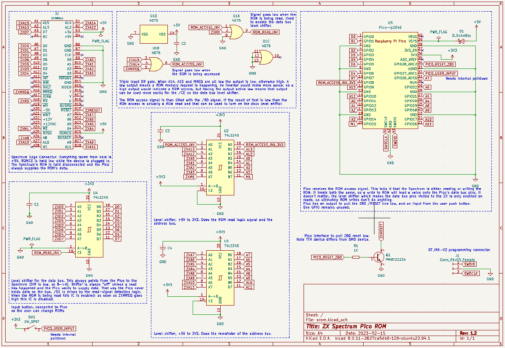

# zx-spectrum-pico-rom

## A Pico-based switchable ROM interface for the ZX Spectrum

This is a ROM interface board for the ZX Spectrum. It presents a new,
selectable ROM image for the machine, replacing the 1982 BASIC one
found in the IC on the Spectrum's PCB.

There are lots of these around, all based on ROM and EEPROM chips. My
design is based on a Raspberry Pi Pico microcontroller programmed to
emulate a ROM chip.

The main advantage of doing it this way is that the Pico has enough
memory for several ROM images, and enough flash for as many ROMs as
anyone would likely ever want. A button allows the loaded ROMs to be
cycled.

It works like this (click through for YouTube video):

https://youtube.com/shorts/0Ot5mol2f5A?feature=share

## Design

The Z80's address and data bus lines are connected to the Pico's
GPIOs.  GPIOs are limited on the Pico (there's only 26), so only 14 of
the 16 address lines are connected. A bit of external logic handles the
top two. The software on the Pico sits spinning, watching for that logic
to indicate that A14, A15 and /MREQ are all zero, that being the indication
of a ZX Spectrum ROM memory access by the Z80. When that condition is
met the address the Z80 is requesting (in the range 0x0000 to 0x3FFF)
is found from the GPIOs connected to the address bus, and the value from
that offset in the currently enabled ROM image is fetched. The 8 bits of
that value are placed on the 8 GPIOs connected as outputs to the Z80's
data bus.

## Hardware design

The Spectrum is +5V, the Pico is 3V3, so every bus or signal pin needs
level shifting, down on the way into the Pico, up on the way out.

GPIO count is also pretty tight, which is why the external logic is
required. It's a simple 3-input OR gate which ORs A14, A15 and
/MREQ. The output of that gate is fed into the Pico, saving 2 GPIOs.

It's important that the device doesn't assert an output value onto the
Z80's data bus until it needs to. This is controlled by hardware. The
data bus level shifter is set permanently to the Pico->ZX direction,
but is left off (via its chip-enable line) until the ROM is being
read. The /CE line is pulled low by the output of the 3-way OR gate,
so when the Z80 is reading from ROM the level shifter is turned on and
the value on the data bus is connected to the Z80. As soon as the
/MREQ line goes high again the OR result goes true and the level shifter
is turned off again.

The Pico needs the ability to reset the Z80, which gets very unhappy if
the ROM program it's running is suddenly changed from underneath it. The
Z80's /RESET line is connected to a GPIO via a transistor; the line is
pulled low via Pico software when the Pico changes the ROM image in order
to reset the Z80.

There's a single user input button connected to the one remaining GPIO
on the Pico. In the current software this cycles the ROM to the next one
in the (compiled in) sequence. The Pico's ADC is available so more buttons
and a better user interface could be constructed using a resistor ladder.

The Z80's /M1 line is connected to a Pico GPIO input. This isn't required
for the typical use case, but it makes the device a useful test bed for
running the ZX Interface One ROM - see below.

### Construction

The gerbers archive for upload, for example, JLCPCB, is
srom/fab1.2/fab1.2.zip. It's a simple 2 layer board.

Note: As of this writing I've not actually had one of these made. I
hand-modified my v1.1 board with the errata from v1.1. The v1.2 design
has had those modifications added so I'd expect it to work exactly the
same as my modified v1.1 board. But I haven't tried it yet. The switch,
in particular, might yet require another tweak depending on what
piece of hardware is chosen. I used a 6mm x 6mm right angle switch.

There's nothing complicated about the soldering. Do the big ICs first
and the Pico sockets, if you use them, last.

## Software Design

The software which runs on the Pico is built on a simple loop which
does this:

 * spin, waiting for the ROM-being-accessed signal to come in
 * read the 14 bits of the address bus from the GPIOs
 * convert that bit pattern into an offset
 * find the value of the byte at that offset into the currently
   used ROM image
 * apply the 8 bits of that byte value to the 8 output GPIOs connected
   to the Z80's data bus
 * go back to the top

The glaring issue here is speed. Pg8 of the Z80 manual says that the
timing for M1, the instruction fetch, is most time critical. The data
is sampled off the bus one and a half clocks after /MREQ goes low. On
the Spectrum's 3.5MHz Z80 that's 4.28571428571e-07 seconds, so about
430ns. Despite several efforts at optimisation I've been unable to get
the Pico to reliably return the data value inside that time frame. Much
to my frustration, v1.2 of the software still requires an overclock from
133MHz to 140MHz.

The Z80 starts up faster than the Pico which requires half a second or
so to get going. This means the Z80 is asking for ROM instructions 
before the Pico is ready to provide them. The Pico resets the Z80 as
soon as it, the Pico, is ready to go. That's why there's a colourful
display of randomness for a moment at startup.

## ROM Images

The device is permanently enabled; the original ROM chip in the
Spectrum is disabled while the interface is attached.

The Pico software contains the ROM images it's compiled with, the
first of which would typically be the original ZX ROM from 1982. I've
added a diagnostics ROM and the Gosh Wonderful ROM since they are free
to redistribute. Games ROMs are not included in the source release but
they can be added fairly easily. A Linux command like:

 xxd -i spaceraiders.rom

will convert a ROM image into 'C' array data which can be dropped into
roms.h.

### Switcher ROM

Some of the ROMs look superficially similar, like the original 1982
ROM and the Gosh Wonderful ROM. It got confusing trying to work out
what was running. I wanted a row of LEDs across the top of the device
to act as an indicator of which ROM was in use, but I didn't have any
GPIOs to implement it with. So I added an extra ROM image I called the
"switcher" ROM.

This program is written in 'C' and compiled with Z88DK. The source is
in the firmware/switcher directory. It presents a banner saying what ROM
is coming up next, then sits indefinitely buzzing the Spectrum's border.

")

When the user input button is pressed, the Pico software selects this
switcher ROM and resets the Z80 to start it running. The banner appears
on the Spectrum screen. About a second later an alarm goes off in the
Pico, the handler for which selects the next ROM in sequence and resets
the Z80 again. Thus the switcher ROM appears as a banner on the Spectrum
screen between each ROM switch.

## ZX Interface One

This device can also switch in and out the ZX Interface One's ROM. This
is an 8K ROM which, in the actual IF1, is paged in by hardware on 3 magic
address accesses: it's paged in when the Z80 requests an instruction from
addresses 0x0008 and 0x1708, and paged out again when the Z80 requests an
instruction from address 0x0700. It's early days with this idea, but that
boils down to this code:

    if( (rom_address == 0x0008) || (rom_address == 0x1708) )
    {
      rom_image_ptr = __ROMs_if1_rom;
    }
    else if( rom_address == 0x0700 )
    {
      rom_image_ptr = __ROMs_48_original_rom;
    }

This needs the /M1 input merged into the logic, but that's the
idea. The joys of programmable devices like the Pico, as opposed to
hardware. :)

There's a macro in the firmware source to switch in an early IF1 paging
version of the code. It seems unreliable, but I won't be persuing this
any further with this project.

Note: the v1.1 board doesn't have the /M1 signal connected. The v1.2
board has it connected into GPIO15. The software doesn't have the /M1
signal taken into account as yet.

## Bill of Materials

You will need:

3x [74LS245 Bus transceiver](https://www.mouser.co.uk/ProductDetail/595-SN74LVC245ANSR)
Bus transceiver, used as a level shifter
 
1x [3216 SMD Diode](https://www.mouser.co.uk/ProductDetail/581-SD1206S040S2R0)
Schottky Diode for Pico input protection
 
1x [4075 OR gate](https://www.mouser.co.uk/ProductDetail/595-SN74HCS4075DR)
3-way 3-input OR gate
 
4x [3216 SMD 0.1uF capacitor](https://www.mouser.co.uk/ProductDetail/581-12065C104KAT4A)
Decoupling capacitor
 
1x [PMBT2222A SMD Transistor](https://www.mouser.co.uk/ProductDetail/771-PMBT2222A-T-R)
NPN Transistor for /RESET
 
1x [3216 SMD 1K Resistor](https://www.mouser.co.uk/ProductDetail/603-RT1206FRE071KL)
1K Resistor for /RESET

Also:

1x Raspberry Pi Pico with pins and sockets if you want them
 
1x ZX Spectrum Edge Connector socket
 
1x SPST switch any single pole, single throw switch to use as an input button. The footprint
on the board matches one I happen to have had, assume you'll add it on flying leads.

## Licence

Distributed as free software and hardware design under the GPL. The ROM
images have their own licences, see the ROMs/ directory.

Derek Fountain
February 2023