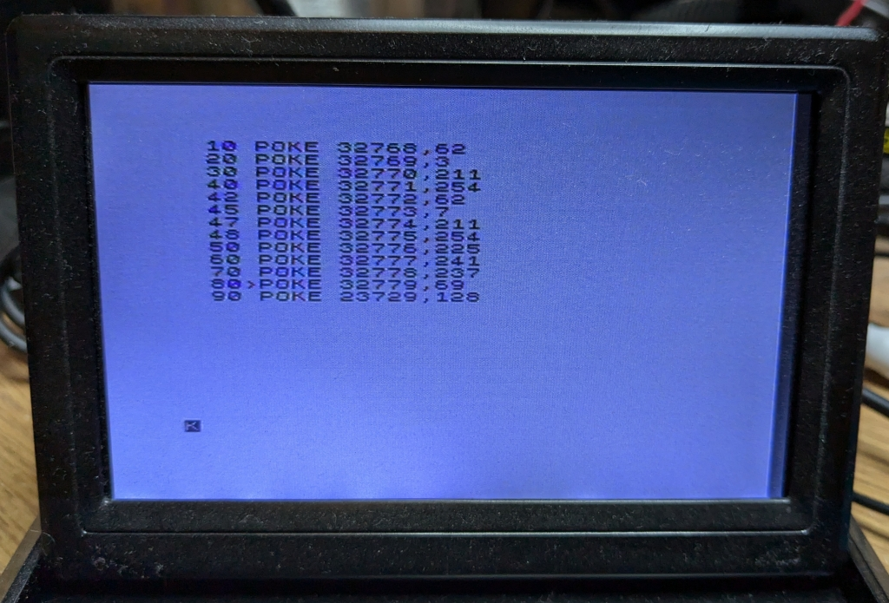

# zx-spectrum-nmi

## A Pico-based NMI testbed for the ZX Spectrum

I wanted to do some experimentation with the Z80's non maskable interrupt.
The Spectrum's NMI handler is buggy in the [Sinclair ROM](https://skoolkid.github.io/rom/dec/asm/102.html)
so it's never been possible to play with it, but with the ROM running from
an interface it's trivial to patch the problem in the interface's ROM image.

### Fixing the bug

The bug is simply a JR NZ instruction where a JR Z instruction was needed.
So my [ROM image](https://github.com/derekfountain/zx-spectrum-pico-rom/blob/9dbc9985f971bbe39fc13d4d96b5a7a9dd7bb2ee/firmware_nmi/roms.h#L18) needs a 0x28 in place of the 0x20, like this:


> 0xb5, 0x28, 0x01, 0xe9, 0xe1, 0xf1, 0xed, 0x45, 0x2a, 0x5d, 0x5c, 0x23,   /* <-- Fix at second byte here */

Simple.

### Modifying the interface

There's only one GPIO free on the board design, which is GPIO15. So I wired
that from the Pico to the NMI pin on the Spectrum's edge connector. This
gives the Pico the ability to trigger the Z80's NMI.

### Updating the interface code

The code running in the Pico needed a bit of tweaking. What it really needed
was simplfying, since for this project I didn't need any of the ROM switching
code I had in there.

The main issue I found was that the original code was designed to reset the
Spectrum after the switch is pressed. This project needs the Spectrum to keep
running after the switch is pressed, and it didn't. So that got restructured
a bit, then I found I had a timing problem.

The ROM emulation doesn't have much time to spare. It already had a slight
overclock on the RP2040 to make it reliable, and adding more code didn't help.
The code handles the Z80's read, then sits spinning while the Z80 finishes
what it's doing. Once that's complete and the read operation is done, there's
not much time until the next one starts.

It turned out the main culprit was the access to the realtime clock which was
used for the switch debounce logic. Reading that clock takes 1.5uS which is
quite a long time when you're trying to get stuff done between Z80 instructions.
So I changed the debounce algorithm and went to a 200MHz overclock. Not ideal,
but it works well enough.

## The Spectrum end

With the Spectrum's ROM bug fixed, the operation of the NMI is as follows.

You put an NMI handler in memory somewhere, then set the NMIADD (at 23728)
system variable to point to it. When the NMI line is pulled low the Z80 will
jump to adress 0x0066 where the (fixed) handler will save AF and HL on the
stack, then jump to the address NMIADD points to.

So I put this little program in RAM at 0x8000:

```
ld a,3
out (254),a
ld a,7
out (254),a
pop hl
pop af
retn
```



So set the border to colour 3 (magenta) then set it back to colour 7 (white),
then restore the registers and return from the NMI. POKEing 23729 with 0x80
sets up NMIADD and ... it works! When I press the button on the interface
there's a quick flicker of magenta in the border.

I was quite pleased with getting that to work, but I can't really think what
to do with it.

[Derek Fountain](https://www.derekfountain.org/zxspectrum.php), December 2024