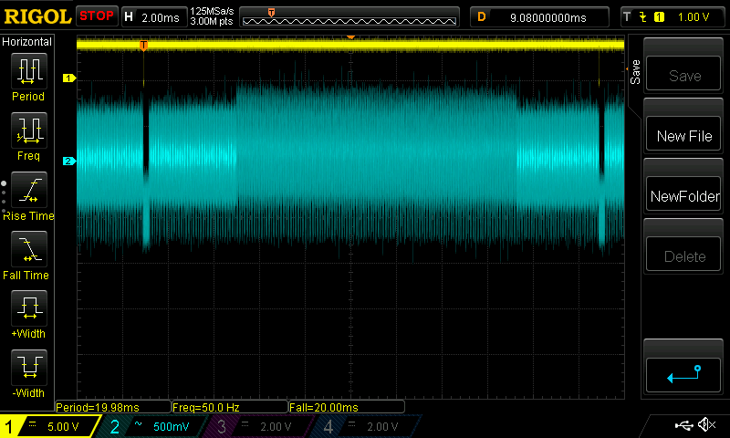
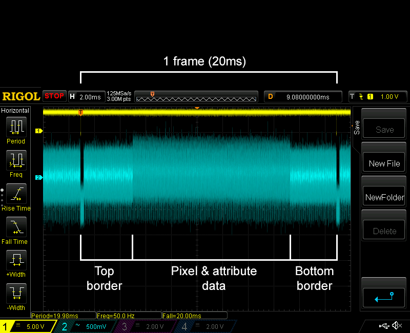
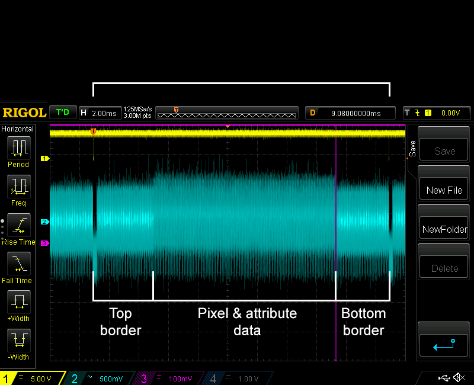

# zx-spectrum-lower-border-nmi

## A Pico-based NMI at the lower border point for the ZX Spectrum

I previously did some work looking at the use of the Z80's Non Maskable Interrupt with the ZX Spectrum. That work is [here](https://github.com/derekfountain/zx-spectrum-pico-rom/tree/main/firmware_nmi).

This sub-project builds on that idea, using RP2040 PIOs to generate a non maskable interrupt at a precisely defined point in the frame generation.

### Background

As most Spectrum aficionados know, the best time to redraw the screen and update sprites is when the border is being drawn. That way the screen won't flicker. Only, the Spectrum's hardware only has a single timer, which is the 50Hz signal the ULA emits when the video frame is about to be generated - i.e. when the raster beam is at the very top of the screen.

What might be useful, I thought, is a different interrupt which fires just as the ULA finishes drawing the screen data, which is the point it's just about to start drawing the lower border. Synching a program to that signal would give quite a bit more time to update the screen - the time needed to draw the lower border, plus the time needed to draw the top border.

This idea would require very precise timing, and the only reference point is the ULA's INT signal. The RP2040 on the Pico has its PIOs, which are very good at very precise signal handling. This project uses the PIOs to generate a NMI signal exactly as the ULA is about to start drawing the lower border.

### The Video Frame

A frame of the Spectrum's video signal looks like this on an oscilloscope (yellow trace shows the interrupt (INT) signal):



There are 3 clearly defined areas of this signal, as annotated here:



(Zooming in to the oscilloscpe trace shows the 192 lines of pixel data in that central block.)

The goal of this project is to generate a NMI signal at the exact point the bottom border is about to be drawn, as shown by the purple line here:



### The Result

The project works as designed, using a PIO-derived signal on each frame of video data (i.e. at 50Hz) to generate a non maskable interrupt on the Z80.

Look carefully at this photo of a Spectrum screen and you'll notice a thin, fractional, magenta line being drawn just underneath the lowest line of text:


That line is being drawn in the lower border by a NMI handler routine which just changes the border colour to magenta, then changes it back to white. The thin line thus created in the border is permanent, it just sits there. That includes when the Spectrum is running machine code programs with the interrupts disabled - it's a non maskable interrupt which is putting that line there.

This isn't a particularly useful example but it shows the NMI is being generated at exactly the right time, and the Z80 is running a simple handler for it.

## How it works

There are several pieces to this.

### ROM Emulator (modified)

The first is the piece of hardware which connects the Pico to the ZX Spectrum. For that I've used my ROM emulator project, which is the parent project of this one.

I modified it slightly, attaching the Z80's /INT signal to the Pico's GPIO 15. Ideally it would come in via a level shifter (5V to 3V3) but I didn't have a spare level shifter port. The RP2040 can handle a 5V input like this, so it's OK. The other modification is the NMI output signal from the RP2040 to the edge connector, and hence on to the Z80. I reused the original switch GPIO for this, that not being needed on this project.

So, just the two patch wires needed to modify the hardware.

### A PIO Program

The Spectrum's video takes exactly 20ms to draw, and hence runs at 50 frames per second. It's [312 scan lines high](https://worldofspectrum.org/faq/reference/48kreference.htm): 64 scans for the top border, 192 scans for the pixel data, then 56 scans for the lower border. Each scan line takes 224 T-states of the 3.5MHz Z80 to draw. Long story short, the NMI is required exactly 64+192 scan lines after the /INT signal is received. That's 64us, after which the /NMI signal to the Z80 needs to be pulled low.

The PIO program in this project does exactly that: wait for the /INT signal, then wait 64us, then pull the output GPIO low. The PIO program is this:

```
	 set pins, 1
 .wrap_target
	 wait 0 pin 0 [31]

     set x, 30 [31]
 first_lines:                                           
	 nop [31]
	 jmp x--, first_lines [31]

	 set pins, 0
	 set pins, 1
 .wrap
```

Start with the NMI output high, then wait for the /INT. There's a loop full of NOPs, then it toggles the output pin low and high. The numbers in square brackets are the delays on the PIO instructions, selected to set the timing exactly right. The lengthy comments in the PIO source code detail how the delays were worked out. I found it easier to reduce the clock speed of the PIO state machine from the 125MHz it normally runs at down to 125KHz. That made the correct delays much easier to generate.

### Spectrum ROM (modified)

When the Z80 receives the /NMI signal it jumps to location 0066h, which is in the Spectrum's ROM. The routine at that location isn't used, probably because it's buggy. But because I used my ROM emulator as the basis for this project, I'm in control of what's in the ROM, and I can fix the bug. In fact, what I actually did during development was put a single RETN instruction at location 0066h, which made testing predictable.

For the final version, which draws that magenta line, I put this in the ROM:

```
push af
ld a, 3
out (254),a
out (254),a
ld a, 7
out (254), a
pop af
retn
```

The original handler is 14 bytes, and that is 14 bytes, including the repeated 'out' instruction to set the border magenta. I had those 2 bytes spare, so I repeated the border colour change to make the magenta line a bit longer. Come to think of it, 2 NOPs would have done the job.

## Any Real Application?

This was mostly an exercise is trying to do something with non maskable interrupts on the Spectrum and PIOs on the RP2040. But it might have a real world application.

The Spectrum is a games machine, and I have in the past pondered hardware which would make for better games: smoother sprites, larger scrolled areas, etc. This would be a starting point, giving the games programmer a more reliable alternative to the [floating bus trick](http://sky.relative-path.com/zx/floating_bus.html), which aims to do the same thing from software.

In practise, um, no, not really, but if anyone has a use for it, feel free. :)

[Derek Fountain](https://www.derekfountain.org/zxspectrum.php), February 2025